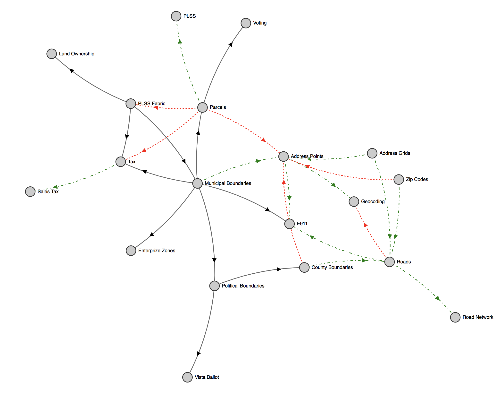

## Identify all internal SGID-related data processes

 
Click to see dataset's that are updated

 
##### Address Points
 - Zach
 - Greg

##### Broadband
 - Zach
 - Bert

##### Boundaries
  - Mike
  - **Datasets**
    - Municipalities
    - County
    - Voting/Precinct
    - Tax

##### Roads
 - Michael
 - Greg

##### Parcels
  - Rick
  - **Datasets**
    - Normal Parcels
    - LIR

##### Imagery
  - Rick
  - **Datasets**
    - Indices
    - Raster.utah.gov

##### Zone Boundaries
  - Dave
  - **Datasets**
    - PSAPS
    - Fire
    - EMS
    - Law
    - City Codes

## Document and review processes

 
Click to see all discovered processes

 
1. **Address Points**
   1. Existing scripts are written, 1 per participating county
   1. Incomplete because data is not received from
      - Daggett
      - Unitah
      - San Juan
      - Grand
      - Garfield
      - Sanpete
1. **Broadband**
   1. needs documentation but automation is not the best fit
1. **Boundaries**
   1. **Municipal/County Boundaries**
      1. PDF or jpg provied by LGO after county submission
      2. Outline is created with COGO tools in state plane and added to muni_modifications
      3. (muni/county)_modification polygon is **manually** used to adjust official boundary feature class and muni carto feature class
      4. blog post created quarterly
  1. **Precints (Vista Ballot Areas)**
     1. Mostly shapefiles received from counties
     2. ETL **manually** into our schema
     3. Validated on overlap with political districts and issues fixed
  1. **PLSS Fabric**
     1. BLM appends mini fabrics
     2. Counties and surveyors can submit tie sheets for corner adjustments
     3. Uses mostly built in fabric tools from vendor
     4. Exported to PLSS GCDB format and appends attributes **manually**
  1. **Tax Nomenclature**
     1. Terri C from tax provides individual geodatabases
     2. **Manually** create new tax areas using tax [process doc](https://docs.google.com/document/d/1Z8i0icMP3EeV0sI2BENhZNfAVTbfuyZfSm59Mwb3XBg/edit)
     3. **Manual** and scripted review happens based on checklist with exceptions
     3. Create prior years and publish new years
     4. Data can be updated quarterly
     5. Blog post is created yearly
1. **Roads**
   1. Data is requested from counties based on a schedule
   1. Data is edited in UTRANS
   2. Scripts are run to ETL data
   3. Change detection is run
   4. Custom tool helps reconcile differences in provided vs new data
   5. Monthly blog post
1. **Parcels**
   1. Existing scripts ETL data into our schema. One per county.
1. Sales Tax Areas need to align with municipal and county boundaries
   1. schema and attribute checks
1. Health stuff is loaded/edited adhoc when reached out to by stewards
   1. email sent with instructions
1. **PSAPS**
   1. Only certain dispatch centers are supported
      1. box elder
      1. vernal dispatch
         1. Daggett, Duchesne, Uintah
      1. salt lake communication center (TOC)
      1. weber/morgan
      1. cedar dispatch
         2. Iron co
         1. cedar also dispatches DPS on highways, etc
      1. st george dispatch
      1. san juan
      1. beaver
      1. miller
  1. **Address Points**
     1. ETL address points **manually**
        1. Sevier, Wayne, and Piute Counties they send David the address points  directly
     1. geocodes address points and inspects less than 100% matches
     1. fixes issues **manually**
  1. **Roads**
     1. Inspectes segments with geocodes scores < 100%
     2. Edits in spillman and Utrans with a note
1. **Schools**
   1. Spreadsheet from office of ed
   2. Geocoded and ETL to our schema **manually**
   3. Validate addresses and possibly move point
1. **EMS Response Zones**
   1. Come from Department of Health Bureau of EMS.  
   1. They license EMS agencies and the license describes the area of responsibility. 
   1. Polygons are created or modified based on the descriptions.
1. **Care Centers**
   1. Spreadsheet from office of ed
   2. Geocoded and ETL to our schema **manually**
   1. Addresses are validated **manually**
1. **Enterprise Zones**
   1. Kelleigh sends shapefiles in emails
   2. Align boundaries with muni boundaries **manually** splitting where they cross
1. **Zip Codes**
   1. Align boundary with street segments **manually**
   2. Updated after talking to cities and jurisdictions
   3. Can change when code gets subdivided
1. **Address Grids**
   1. Align to boundaries **manually**

## Decide which processes are best to automate

1. David is requesting help with dispatch data sets
2. County Municipal boundaries
   1. would like to automate modification edits to live feature class
      1. currently using the trace tool
1. Vista Ballot Area Updates
   1. The process happens around 29 times a year plus the extras from the organized counties
   2. Might happen a lot more in 2020 with redistricting
   3. would like to automate proposed edits to live propogation (forklift?)
   4. tools to help validate data, topology checks, visual checks, validate vista id's
   5. can be built as a pro addin
1. GCDB
   1. There are currently publishing tools to go from the fabric to individual feature classes
   1. The process could be made smoother with an attribute ETL after the first step
1. Tool to align segments
   1. There seem to be a lot of use cases to be able to select segments from different feature classes and make them coincident 

## Plan an implementation for automatable processes

## Determine data dependencies

https://agrc.github.io/group-two-automation/

1. **green dash** _geometry/attributes are derived_
2. **red dash** _used for quality control_
3. **black** _data aligns to geometries_
